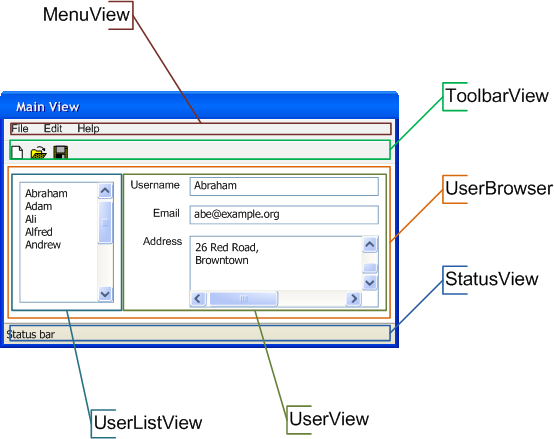

Building Reusable User Interface Components
===========================================

This chapter will describe how reusable components can be created using
pygtkhelpers delegate system. A delegate is a controller for a GTK view. It
interacts closely with GTK, managing such things as signal handling.

Before we start, it is worth considering the alternative method of
creating reusable components, which is custom widgets. This is not a scalable
solution, in that writing custom widgets can only be performed using pure
PyGTK, rather than GtkBuilder files. The maintainance requirement of coded
views versus ui-designed views is large, and using custom widgets in this way
would not allow component hierarchies of ui-designed interfaces.

Your first view
~~~~~~~~~~~~~~~

So, what we will first need is a GTK view. This is what we want to display and
take control of in our delegate. This view can be created using a UI Builder
like Glade, or it can be coded by hand in XML, or in Python, or a combination
of these. The delegate doesn't care *how* you make your GTK, and in fact, from
experience, we know that you will likely mix and match in the same view.

The first thing you will need to do is subclass the View type. This should be
performed for every individual view that is required to be a reusable
component. The type of View you subclass depends on whether the view is a
top-level widget (Window, Dialog, ...) or a slave widget, which can be placed
inside other widgets. The available delegate types are
:class:`~pygtkhelpers.delegates.SlaveView` and
`~pygtkhelpers.delegates.WindowView`:

.. literalinclude:: ../examples/manual/d1.py

I just shows a toplevel Window, with no widgets inside. We are going to leave
that like that, and create a component to go inside. Remember *reusable
components*, there is no point putting UI straight into the Window, although
you could do that, and pygtkhelpers won't stop you:

.. literalinclude:: ../examples/manual/d2.py

This just adds an entry to the widget, which you can see as you run it.

Combining multiple views
~~~~~~~~~~~~~~~~~~~~~~~~

As mentioned, it is best to separate components by their use, so for example in
our user mangement application, the view to edit a User might be consistent
throughout the application. You may want it next to a list, or you may want it
in a dialog. Either way, this should be separated out into it's own view.

This time, we will be using a SlaveView instance, which will be added to our
main view. Adding slaves is achieved with the
:meth:`~pygtkhelpers.delegates.SlaveView.add_slave` method, and is shown in
the following example:

.. literalinclude:: ../examples/manual/d3.py

The main View now *delegates* the responsibility of the user view to one of
its slaves. Of course, every slave can delegate to its own slaves, so you can
build an infinite hierarchy in this way.

If we are to take a slightly more complicated user interface, it may need to
be "chopped up" into further smaller slices. An example of this is shown in
the diagram below:

    Diagram showing the possible ways to segment a complex user interface into
    reusable separate components.

Signal handling and creation
~~~~~~~~~~~~~~~~~~~~~~~~~~~~

Your application would not be much if it could not handle signals.
Pygtkhelpers delegates provide ways to simplify the creation and the handling
of signals.

Signal handling in delegates is performed by providing a delegate method named
appropriately. An example of a delegate method for a widget named "username"
for the "changed" signal would be::

    def on_username__changed(self, widget):
        # handle the signal

There is no magic involved here, there are 3 components to the method name
that comprise a convention:

    1. `on_`
    2. `username__`
    3. `changed`

the `on_` component should be either `on_` or `after_` and is used to
determine whether a widget is connected using `gtk.Widget.connect` or
`gtk.Widget.connect_after`. The `username` component is the attribute name of
the widget in that delegate. Again, this is not magic, any gobject that is an
attribute of a delegate can be connected to.  This includes widgets that are
created using GtkBuilder, or widgets created in the
:meth:`~pygtkhelpers.delegates.BaseDelegate.create_ui` method. It can even
include slaves, as they are gobjects if they are an attribute of a delegate.
The widget name is followed by `__`, (double underscore). And then followed by
the signal name.

The method is automatically connected to the necessary signal, and will be
called appropriately. The aim here is to remove the boilerplate of signal
connection, but like anything in pygtkhelpers, you are entirely free to
connect your signals manually or mix both approaches, which may be appropriate
if you want to connect many signals to the same callback (though in reality,
this is rare)

Lets look at an example of handling a signal:

.. literalinclude:: ../examples/manual/d4.py

This creates a very simple view with a single `gtk.Entry`, but there is a
method on the delegate that connects to the `changed` signal. Our handler is
very basic.

Let's add a signal handler that is a bit more useful:

.. literalinclude:: ../examples/manual/d5.py

This handles the delete-event to our gtk.Window, that is the default "widget"
for a :class:`~pygtkheleprs.delegates.ToplevelView`. It illustrates an
important point that any attribute of the delegate can have it's signals
connected to if that is a GObject instance, eg a gtk.Widget or any
pygtkhelpers Delegate. As long as the item has been set as an attribute on the
delegate by the end of the create_ui method, it can be connected in this way.

Pygtkhelpers has a utility function for helping to define signals for GObject
isntances: :func:`~pygtkhelprs.utils.gsignal`. This can be used on any widget
subclass, or delegate.

The following example illustrates two delegates, one receiving signals from
the other, all using the simple declarative handling style above:

.. literalinclude:: ../examples/manual/d7.py

In this example, it can be seen that since the slave is added, it can be
connected to by defining the correct "on_" named method.

The gsignal function can also be used to define more complex signals with
parameters, as in the following example:

.. literalinclude:: ../examples/manual/d6.py

